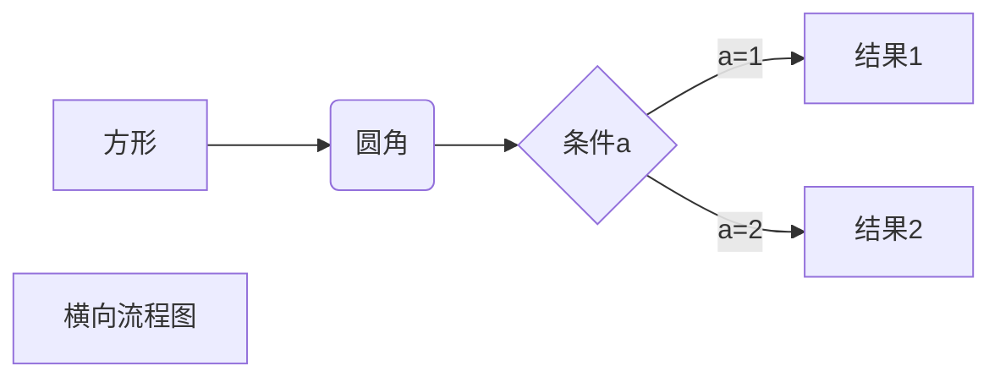
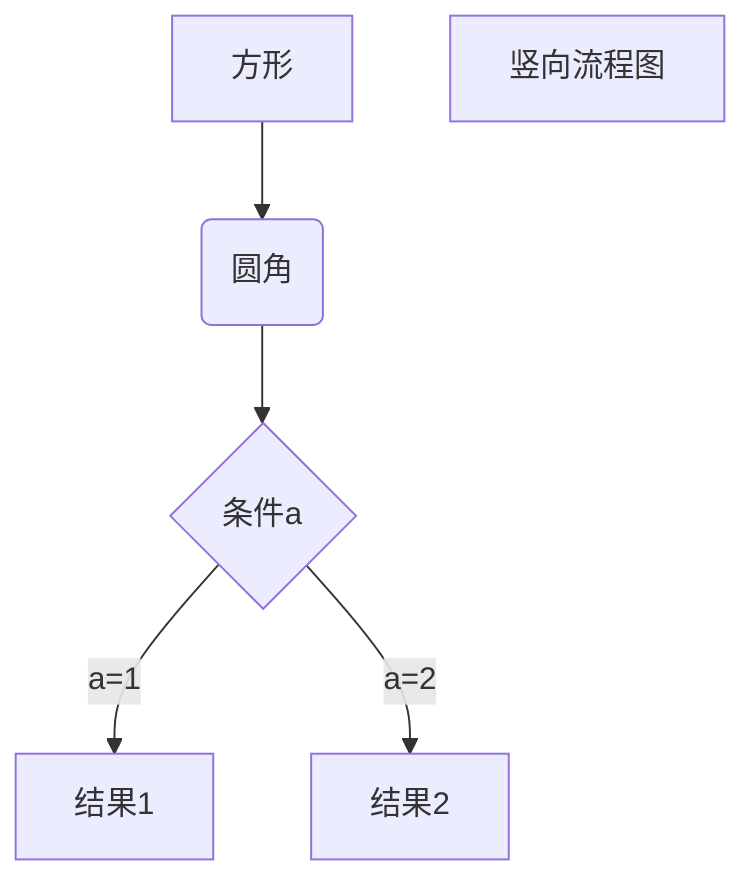
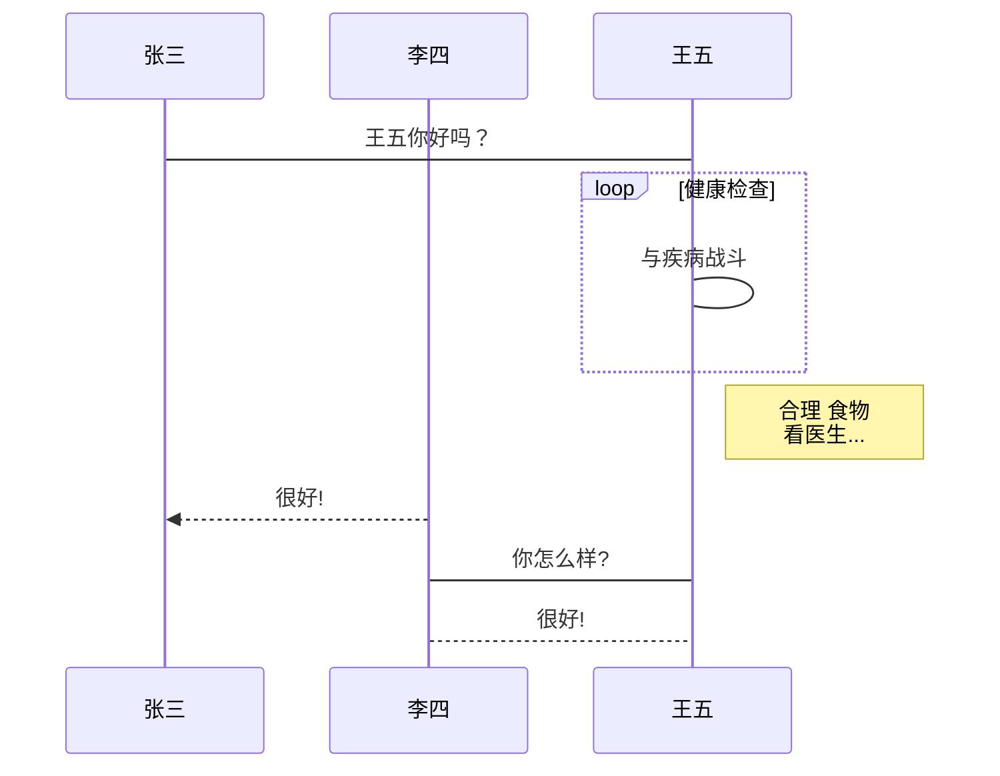
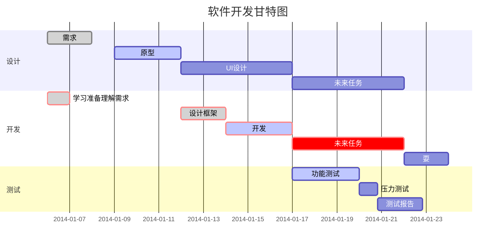

一级标题
========

二级标题
--------

# 一级标题

## 二级标题

### 三级标题

#### 四级标题

##### 五级标题.....

*斜体*
_斜体_

**粗体**
__粗体__

***粗斜体***
___粗斜体___

分隔线：
***
---

* * *
- - -

******

删除线：

~~BUTTON~~

下划线：

<u>BUTTON</u>

脚注：

脚注[^RUNOOB]。

[^RUNOOB]: 这是脚注！


* 第一项
* 第二项
* 第三项

+ 第一项
+ 第二项
+ 第三项


- 第一项
- 第二项
- 第三项

1. 第一项
2. 第二项
3. 第三项

1. 第一项：
    - 第一项嵌套的第一个元素
    - 第一项嵌套的第二个元素
2. 第二项：
    - 第二项嵌套的第一个元素
    - 第二项嵌套的第二个元素

> 区块

> 区块
>> 内嵌区块1
>>> 内嵌区块2

>区块

> 区块中使用列表
> 1. 第一项
> 2. 第二项
> + 第一项
> + 第二项
> + 第三项

* 第一项
    > 区块1

    > 区块2
* 第二项

段落上的一个函数或片段的代码 `printf()`

代码区块使用 4 个空格或者一个制表符（Tab 键）。
也可以用 ``` 包裹一段代码，并指定一种语言（也可以不指定）：
```javascript
$(document).ready(function () {
    alert('RUNOOB');
});
```
这是一个链接[链接名称](https://www.baidu.com)

<https://www.baidu.com>

>这个链接用 1 作为网址变量 [Google][1]
>这个链接用 runoob 作为网址变量 [Runoob][runoob]
>然后在文档的结尾为变量赋值（网址）
>> [1]: http://www.google.com/
>> [runoob]: http://www.runoob.com/

图片：


examples:


也可以像网址那样对图片网址使用变量:

这个链接用 1 作为网址变量 [RUNOOB][1].
然后在文档的结尾为变量赋值（网址）

[1]: http://static.runoob.com/images/runoob-logo.png

Markdown 还没有办法指定图片的高度与宽度，如果你需要的话，你可以使用普通的  标签。


Markdown 制作表格使用 | 来分隔不同的单元格，使用 - 来分隔表头和其他行。

|  表头   | 表头  |
| -----  | ----  |
| 单元格  | 单元格 |
| 单元格  | 单元格 |

我们可以设置表格的对齐方式：
> -: 设置内容和标题栏居右对齐。

>:- 设置内容和标题栏居左对齐。

>:-: 设置内容和标题栏居中对齐。

examples:
| 左对齐 | 右对齐 | 居中对齐 |
| :-----| ----: | :----: |
| 单元格 | 单元格 | 单元格 |
| 单元格 | 单元格 | 单元格 |


不在 Markdown 涵盖范围之内的标签，都可以直接在文档里面用 HTML 撰写。

> 使用 <kbd>Ctrl</kbd>+<kbd>Alt</kbd>+<kbd>Del</kbd> 重启电脑

## Markdown 使用了很多特殊符号来表示特定的意义，如果需要显示特定的符号则需要使用转义字符，Markdown 使用反斜杠转义特殊字符

**文本加粗**

\*\* 正常显示星号 \*\*


* Markdown Preview Enhanced 使用 KaTeX 或者 MathJax 来渲染数学表达式。

* KaTeX 拥有比 MathJax 更快的性能，但是它却少了很多 MathJax 拥有的特性。你可以查看 KaTeX supported functions/symbols 来了解 KaTeX 支持那些符号和函数。

* 默认下的分隔符：

> \$...\$ 或者 \(...\) 中的数学表达式将会在行内显示。

> \$$...\$$ 或者 \[...\] 或者 ```math 中的数学表达式将会在块内显示。

> $$
\begin{Bmatrix}
   a & b \\
   c & d
\end{Bmatrix}
$$

> $$
\begin{CD}
   A @>a>> B \\
@VbVV @AAcA \\
   C @= D
\end{CD}
$$


1、横向流程图源码格式：


2、竖向流程图源码格式：


3、标准流程图源码格式：

```flow
st=>start: 开始框
op=>operation: 处理框
cond=>condition: 判断框(是或否?)
sub1=>subroutine: 子流程
io=>inputoutput: 输入输出框
e=>end: 结束框
st->op->cond
cond(yes)->io->e
cond(no)->sub1(right)->op
```
4、标准流程图源码格式（横向）：

```flow
st=>start: 开始框
op=>operation: 处理框
cond=>condition: 判断框(是或否?)
sub1=>subroutine: 子流程
io=>inputoutput: 输入输出框
e=>end: 结束框
st(right)->op(right)->cond
cond(yes)->io(bottom)->e
cond(no)->sub1(right)->op
```
5、UML时序图源码样例：

```sequence
对象A->对象B: 对象B你好吗?（请求）
Note right of 对象B: 对象B的描述
Note left of 对象A: 对象A的描述(提示)
对象B-->对象A: 我很好(响应)
对象A->对象B: 你真的好吗？
```
6、UML时序图源码复杂样例：

```sequence
Title: 标题：复杂使用
对象A->对象B: 对象B你好吗?（请求）
Note right of 对象B: 对象B的描述
Note left of 对象A: 对象A的描述(提示)
对象B-->对象A: 我很好(响应)
对象B->小三: 你好吗
小三-->>对象A: 对象B找我了
对象A->对象B: 你真的好吗？
Note over 小三,对象B: 我们是朋友
participant C
Note right of C: 没人陪我玩
```
7、UML标准时序图样例：


8、甘特图样例：



